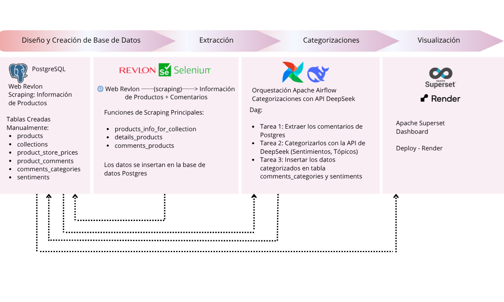
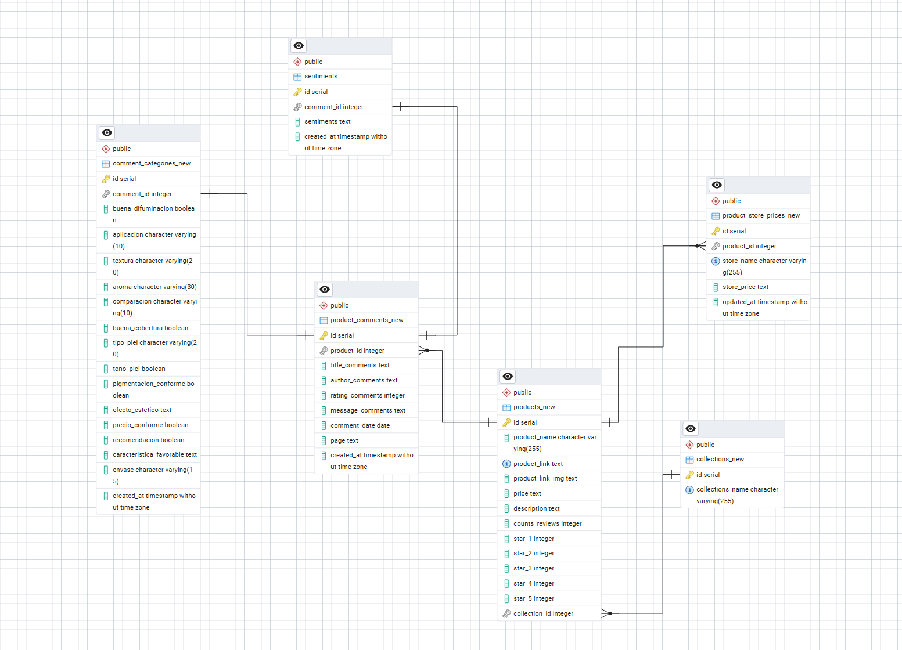

# 🧪 Proyecto Revlon: Extracción y Categorización de Opiniones

## 📝 Introducción

El presente proyecto tiene como objetivo la implementación de un sistema integral de extracción, procesamiento y análisis de datos provenientes del sitio web de Revlon, utilizando técnicas de web scraping y orquestación automatizada para las categorizaciones de los comentarios. La solución contempla desde la captura de información de productos y comentarios de usuarios hasta su categorización mediante la API de DeepSeek, permitiendo generar insights relevantes sobre la percepción de los productos y tendencias de opinión.

## 🎯 Alcance del sistema

La arquitectura propuesta se compone de los siguientes bloques funcionales:

### 1. Extracción de datos
Mediante scripts desarrollados con Selenium, se realiza scraping estructurado sobre la web de Revlon para obtener:
- Información general de productos (`products_info_for_collection`)
- Detalles específicos de cada producto (`details_products`)
- Comentarios de usuarios asociados (`comments_products`)
- Precios disponibles en las diferentes tiendas online (`store_prices`)

### 2. Almacenamiento en base de datos PostgreSQL
Los datos extraídos se persisten en tablas diseñadas manualmente:
- `products`
- `collections`
- `product_store_prices`
- `product_comments`

### 3. Orquestación con Apache Airflow
Se define un DAG (Directed Acyclic Graph) que ejecuta de manera automatizada y secuencial las siguientes tareas:
- **Tarea 1:** Extracción de comentarios desde PostgreSQL
- **Tarea 2:** Categorización mediante API de DeepSeek (análisis de sentimientos y asignación de tópicos)
- **Tarea 3:** Inserción de resultados en las tablas `comments_categories` y `sentiments`

### 4. Visualización y análisis
Los datos categorizados permiten generar reportes y dashboards para el monitoreo de la reputación de productos, tendencias de opinión y distribución de tópicos por categoría de comentario.

## 🛠️ Tecnologías clave

- **PostgreSQL** – Base de datos relacional
- **Selenium** – Automatización de navegador para scraping dinámico
- **Apache Airflow** – Orquestación de flujos de trabajo
- **DeepSeek API** – Modelo de IA para categorización de texto (sentimientos y tópicos)

## Base de Datos

